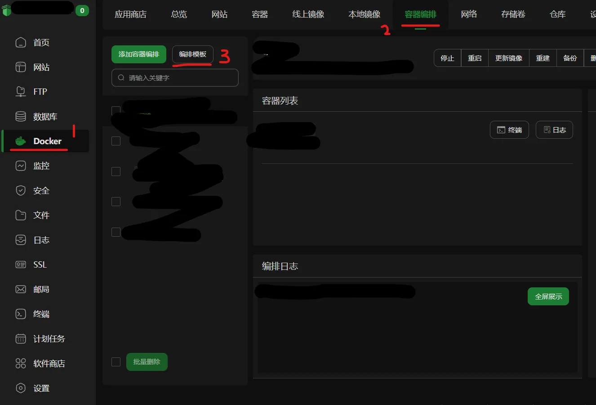
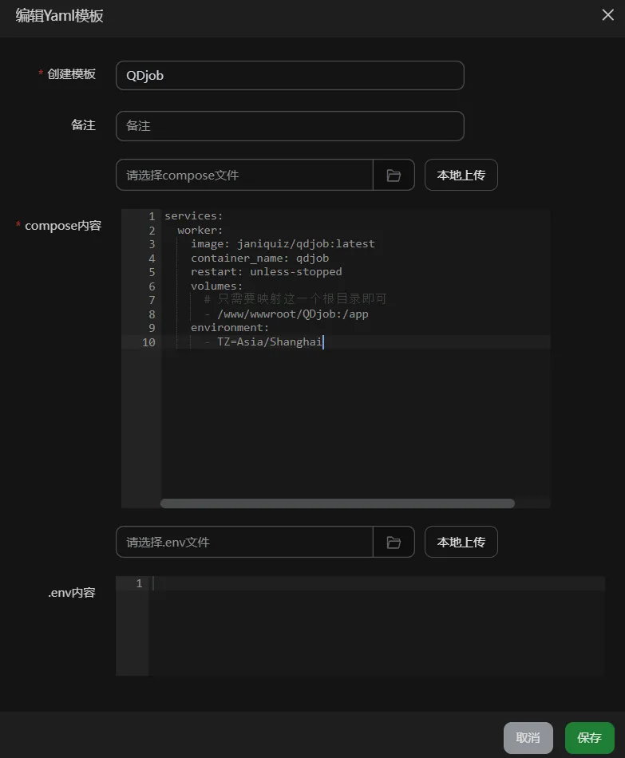
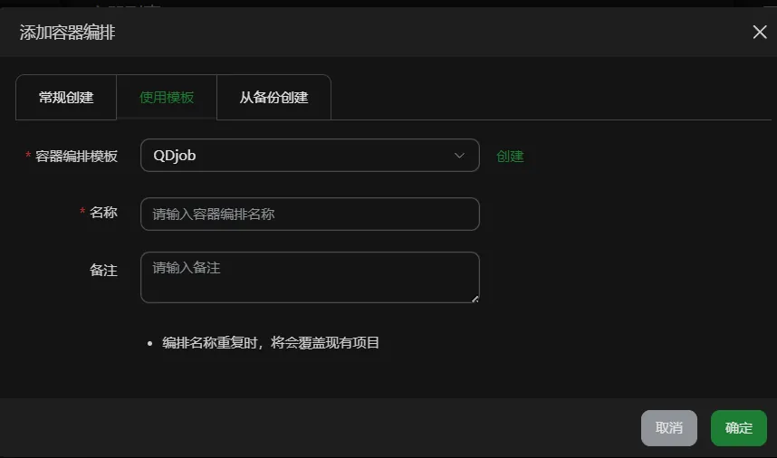

# Docker部署（侧重于宝塔面板）

在开始最好先通过 windows 版本 QDjob_editor.exe 添加好用户并成功完成测试，以下步骤默认已经完成用户配置，有`config.json`,`cookies文件夹`

## 宝塔面板部署

新手在服务器设备性能充足情况下使用宝塔面板部署可以方便很多

### 宝塔面板安装

复制执行下方通用一键安装脚本

```bash
if [ -f /usr/bin/curl ];then curl -sSO https://download.bt.cn/install/install_panel.sh;else wget -O install_panel.sh https://download.bt.cn/install/install_panel.sh;fi;bash install_panel.sh ed8484bec
```

自动安装完成后宝塔面板的初始登录信息会显示在上方安装日志，注意查看

注意需要根据实际情况开放宝塔面板端口

### 容器编排

左侧点击 docker（初次使用需要安装），再右侧点击容器编排，编排模板，点击添加


模板名字任意，compose 内容填写见附录[compose 容器编排](#compose-容器编排)



按图中设置完毕即可保存

### 添加容器

还是在容器编排页面，点击添加容器编排，使用模板，编排模板选择之前创建的模板，容器名任意，设置好后点击创建



接下来会自动拉取镜像并创建容器，等待容器成功创建就会自动运行

### 导入配置

在右方菜单点击文件，跳转到 compose 中映射的文件夹，这里是`/www/wwwroot/QDjob`,将本地配置好的`config.json`,`cookies文件夹`拖入覆盖


默认自动在每日的中午 12 点执行任务，如果需要更改请编辑`crontab.txt`,简单规则介绍见附录[Cron 表达式结构](#cron-表达式结构)

## docker命令运行

自行搜索相关教程（docker安装）容器运行命令等，容器镜像地址为`janiquiz/qdjob:latest`

## docker compose 运行

自行搜索相关教程（docker安装，docker compose安装），compose 内容填写见附录[compose 容器编排](#compose-容器编排)

## 附录

### compose 容器编排

```yaml
services:
  worker:
    image: janiquiz/qdjob:latest
    container_name: qdjob
    restart: unless-stopped
    volumes:
      # 只需要映射这一个根目录即可
      - /www/wwwroot/QDjob:/app
    environment:
      - TZ=Asia/Shanghai
```

`/www/wwwroot/QDjob:/app`中冒号左侧`/www/wwwroot/QDjob`需要更改为自己的数据目录

### Cron 表达式结构

默认配置为：`0 12 * * *`

| 位数（5 位） | 位置 1 | 位置 2 | 位置 3 | 位置 4 | 位置 5 |
| :----------: | :----: | :----: | :----: | :----: | :----: |
|    默认值    |   0    |   12   |   \*   |   \*   |   \*   |
|   代表含义   |  分钟  |  小时  |  日期  |  月份  |  星期  |
|   取值范围   |  0-59  |  0-23  |  1-31  |  1-12  |  0-7   |

**补充**：

1. 星期的取值里，0 和 7 都代表周日，1 代表周一，以此类推。
2. `*`含义是匹配所有值，即不加限定

默认配置`0 12 * * *`的含义是在每一个月、每一天、每一周的任意一天，中午 12 点 0 分执行任务

> compose 配置中 TZ=Asia/Shanghai 代表北京时间
