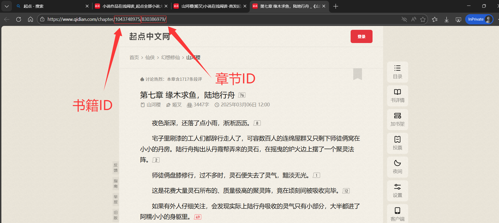

## 使用方法
由于本项目核心加密参数不公开，因此请下载release中的exe文件，并按照以下步骤使用。  
1. **下载[release](https://github.com/JaniQuiz/QDjob/releases)中的`QDjob.exe`和`QDjob_editor.exe`文件，放到同一个目录下**

2. **运行`QDjob_editor.exe`，软件会自动创建配置`config.json`文件，按照下面说明配置用户，目前最大支持3个账号**  
   - 日志等级，日志保留天数，失败重试次数等保持默认即可
   - 添加/编辑用户：
     - 用户名(必填)
     - 用户类型：只能选择captcha
     - tokenid(非必填)：用于自动处理图形验证码，通过[我的网站](https://shop.janiquiz.dpdns.org)或者[我的咸鱼主页](https://m.tb.cn/h.7YjEhOz?tk=2VRJfsPwg93)获取
     - 用户登录(必填)：
       - 手机验证码登录：输入手机号获取验证码登录，成功后会保存设备信息用于后续登录(虽然能登录成功，但是执行任务会提示风险，无法使用)
       - 账号密码登录：输入账号密码登录，必须在成功手机验证码登录后拥有设备信息后才能使用
       - **手动输入cookies**：手动输入抓包或其他手段获取的cookies(目前唯一可行方案)，详细使用方式见下方说明
     - 任务配置(必填)：需要执行的任务，默认全选
     - 推送服务(非必填)：执行完毕后将任务执行情况推送到指定的服务中。
   
3. **cookies说明**  
   一般通过抓包来获取cookies，起点并没有对抓包有什么限制，使用常用的抓包软件就行，这里放上[小黄鸟(过检测版)](https://wwqe.lanzouo.com/iImXX2y6ysje) 密码:`3bt2` 
   建议抓包接口：
    - 福利中心：`https://h5.if.qidian.com/argus/api/v2/video/adv/mainPage` 
    - 观看激励视频任务：`https://h5.if.qidian.com/argus/api/v1/video/adv/finishWatch`    
   
   需要抓取字段包括：
    - User-Agent(必填)：接口的`User-Agent`字段，必须包含`QDReaderAndroid/7.9.384/1466/1000032/OPPO/QDShowNativeLoading`字段，格式类似于
    ```bash
    Mozilla/5.0 (Linux; Android 13; PDEM10 Build/TP1A.220905.001; wv) AppleWebKit/537.36 (KHTML, like Gecko) Version/4.0 Chrome/109.0.5414.86 MQQBrowser/6.2 TBS/047601 Mobile Safari/537.36 QDJSSDK/1.0  QDNightStyle_1  QDReaderAndroid/7.9.384/1466/1000032/OPPO/QDShowNativeLoading
    ```
    - ibex(必填)： 记录设备安全信息，是一段base64编码的数据，较长。
    - cookies(必填)：记录账号登录信息，格式应当为json类型，下方示例中的11项为必须包含字段。本软件提供了字符串格式`cookies`的转换功能，可以将形如`a=b;c=d;...`的字符串转换成json类型，如果抓取到的格式并非json类型，需要进行转换后再进行保存。
   ```json
   {
        "appId": "",
        "areaId": "",
        "lang": "",
        "mode": "",
        "bar": "",
        "qidth": "",
        "qid": "",
        "ywkey": "",
        "ywguid": "",
        "cmfuToken": "",
        "QDInfo": ""
   }
   ```

4. **目录树**  
   当你配置完毕后，目录树结构应当如下：
   ```bash
    .
    ├── cookies/
    │   └── your_username.json
    ├── config.json
    ├── QDjob.exe
    └── QDjob_editor.exe
   ```
   
5. **运行`QDjob.exe`程序或在`QDjob_editor.exe`中点击执行任务**

6. **执行程序**
   * `windows`: 执行`QDjob.exe`或者在`QDjob_editor.exe`中点击执行任务
   * `linux`:
     * 分别打开两个程序的属性设置，设置`QDjob`和`QDjob_editor`程序可执行。

     * 执行`QDjob`或者在`QDjob_editor`中点击执行任务。

## 阅读时长上报使用说明
1. **按照上面说明配置账号**  
2. **获取书籍ID和章节ID**，在起点官网上找到你要上报时长的书籍，查看其网址  
   提取书籍ID: 
   
   提取书籍ID和章节ID: 
   
3. **配置上报数据**，打开`QDjob_editor`，选中用户，打开阅读时长上报界面，将上面的书籍ID和章节ID填入，配置阅读时长和阅读结束时间，程序会自动计算阅读开始时间，添加记录。**建议单次上报时至少上报2条记录**，否则会影响时间统计。
4. **点击确认上报**  
注：上报时长和阅读时间都设定有随机延迟，因此出现9.99分钟为正常现象。

## 额外说明
  * 关于arm64格式：
     * 可以使用在`安卓端termux`或者`树莓派`等arm64架构的linux系统来执行本程序 
     * 由于无法打包图形界面，所以请使用其他端的`QDjob_editor`配置用户完毕后，复制`cookies`文件夹以及配置文件`config.json`到对应的arm64 linux系统下执行程序。


